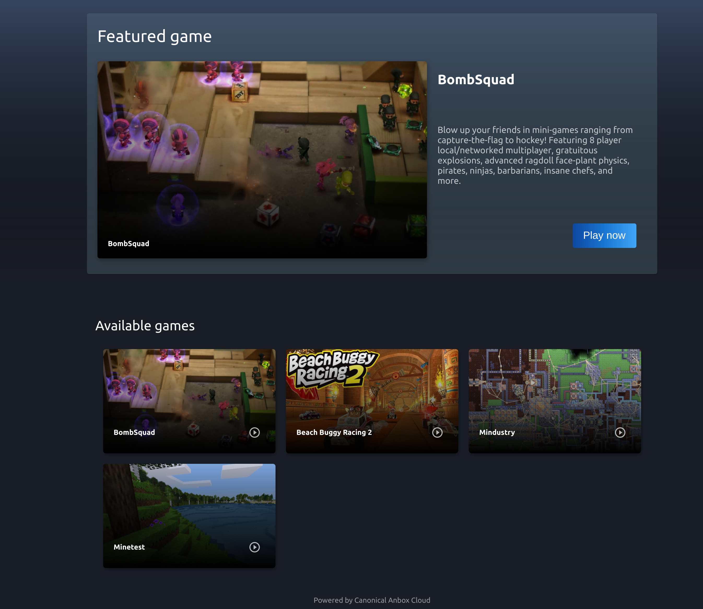

# Cloud gaming demo for Anbox Cloud

This project demonstrates a simple cloud gaming service on top of [Anbox Cloud](https://anbox-cloud.io)
that allows users to play Android-based games right from their web browser on any device.

## Overview

The demo consists of two components:

* A backend service written in [Python](https://www.python.org/)
* A web UI based on [Flutter](https://flutter.dev/)

The backend service connects to the Anbox Cloud services and retrieves a list of available applications.
It also takes care of launching the actual streaming sessions on demand.

Inside the web UI, the user can choose from the list of available games and start playing either of them.



## Install

To run the demo, simply complete the following steps:

1. Install the Anbox Cloud Appliance. See the [documentation](https://anbox-cloud.io/docs/tut/installing-appliance) for instructions.
2. SSH to your appliance instance, clone the demo repository and run the installation script:

    ```
    git clone git://github.com/anbox-cloud/cloud-gaming-demo
    cd cloud-gaming-demo
    sudo scripts/install.sh
    ```

The installation takes some time because it fetches and installs a selection of freely available Android
game titles.

At the end, the installation script prints the URL where you can access the demo. Happy gaming!

## Uninstall

In case that you don't want to use the cloud gaming demo any longer you can simply uninstall it from
your Anbox Cloud Appliance by running the following commands

    cd cloud-gaming-demo
    sudo ./uninstall.sh

Afterwards all configuration and the cloud gaming demo itself is removed from the machine.

## Secure access via HTTP basic auth

By default the demo is exposed without access control. However you can easily add HTTP basic auth by changing
the [traefik](https://traefik.io/) configuration at `/var/snap/anbox-cloud-appliance/common/traefik/conf/cloud-gaming-demo.yaml`
by adding a HTTP basic auth middleware definition (see [here](https://doc.traefik.io/traefik/v2.0/middlewares/basicauth/)
for more details).

First we have to use the `htpasswd` tool to generate a user/password combination

    apt install -y apache2-utils
    httpasswd -n <your user name>

On the prompt enter your desired password. The printed user/hashed password combination can now be
inserted into the traefik configuration. For that open `/var/snap/anbox-cloud-appliance/common/traefik/conf/cloud-gaming-demo.yaml`
in an editor and change the configuration to look like:

    http:
    routers:
        ...
        middlewares: ["ratelimiter", "strip-demo-prefix", "demo-auth"]
    middlewares:
        ...
        demo-auth:
            basicAuth:
                users:
                - "<user name>:<hashed password>"
    ...

Afterwards every user will be asked for username and password when accessing the demo site.

## Build

If you want to build the [snap package](https://snapcraft.io) including the demo UI and service yourself
you first have to install the [snapcraft](https://snapcraft.io) build tool. Please find further details
[here](https://snapcraft.io/docs/snapcraft-overview)

Once you have snapcraft installed all you have to do is running the following command:

    snapcraft

This will start the build process and procude a `.snap` package at the end which you can install with

    snap install --dangerous cloud-gaming-demo*.snap

## Used games

The demo uses the following games:

 * [BombSquad](http://www.bombsquadgame.com/)
 * [Mindustry](https://github.com/Anuken/Mindustry)

## Get help & community

If you get stuck deploying the demo or would like some help with Anbox Cloud in general, come and ask on the [Anbox Cloud discourse forum](https://discourse.ubuntu.com/c/anbox-cloud)!

## More information

You can find more information about Anbox Cloud on the [website](https://anbox-cloud.io) and in the
[documentation](https://anbox-cloud.io/docs).

If you're interested in building a real production cloud gaming service, [get in touch](https://anbox-cloud.io/contact-us)!